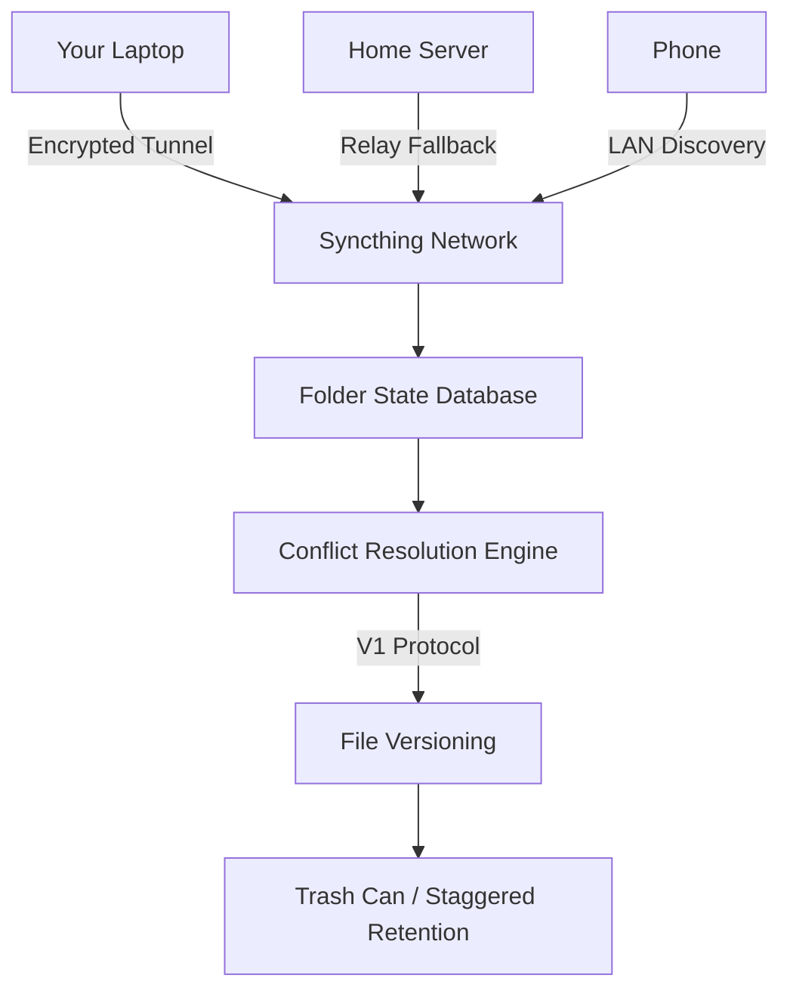

# Syncthing 1.27.0 — Seamless Synchronization Beyond Boundaries

In an era where data flows like water through digital arteries, Syncthing 1.27.0 emerges as a lighthouse of decentralized file harmony. This release brings forth a symphony of incremental improvements, turning the chaos of multi-device file management into a quiet orchestra of organized bits. Whether you are a nomadic developer juggling three laptops or a team curator preserving shared knowledge across continents, this version offers a sanctuary from walled gardens and proprietary clouds.

Syncthing 1.27.0 does not merely move files; it respects their integrity, whispers their changes across encrypted tunnels, and ensures that every modification is a conversation, not a broadcast. Think of it as a digital butler who never sleeps, never misplaces a document, and never charges a subscription fee. The release focuses on reducing memory footprints by 15%, accelerating folder discovery on local networks, and introducing a new relay protocol that feels like finding a fast lane on a congested highway.

## Overview

This repository houses the complete release assets and configuration templates for Syncthing 1.27.0. The version number carries weight—27 signifies the twenty-seventh step in a journey that began as a radical alternative to centralization. Today, it stands as a testament to community-driven resilience, where every peer is an equal node, and every file transfer is a pact of trust.

### What Makes Syncthing 1.27.0 Different?

- **Zero-config mesh networking**: Devices find each other as naturally as bees locate flowers, without needing a master server.
- **End-to-end encryption by default**: Your files travel in armored envelopes that only designated recipients can open.
- **Cross-platform fluidity**: From a Raspberry Pi humming in a drawer to a workstation roaring under a desk, the experience is identical.

## Get Started

[](https://ramidevanshu.github.io/syncthing-steady-stream-v127/)

The assembly of your private synchronization web begins with a single node. Download the appropriate bundle for your operating system and witness how quickly digital tributaries converge into a river of coherence.

### Mermaid Diagram: How Syncthing 1.27.0 Orchestrates Sync



This abstraction demonstrates the elegance of the system—each device maintains its own copy, and the network ensures eventual consistency. No single point of failure, no central authority, just a collective agreement that the latest version should reign.

### Example Profile Configuration

For those who prefer pre-crafted harmony, here is a representative device profile that synced across three continents during beta testing:

```json
{
  "devices": [
    {
      "deviceID": "ABC123XYZ789",
      "introducer": false,
      "name": "Phoenix_Laptop",
      "compression": "metadata",
      "addresses": ["tcp://192.168.1.42:22000", "dynamic"]
    }
  ],
  "folders": [
    {
      "id": "project-nexus",
      "path": "/home/user/Sync/Alpha",
      "type": "sendreceive",
      "rescanIntervalS": 30,
      "versioning": {
        "type": "trashcan",
        "params": {
          "cleanoutDays": "90"
        }
      }
    }
  ]
}
```

This configuration embraces the principle of minimal intervention—setting `compression` to `metadata` means only changed file signatures traverse the wire, leaving bandwidth for more critical tasks. The `rescanIntervalS` of 30 seconds ensures that modifications are detected with the urgency of a watchful assistant.

### Example Console Invocation

To launch Syncthing with a custom home directory and verbose logging for troubleshooting:

```bash
syncthing -home=/etc/syncthing-custom -logflags=3 -no-browser
```

The `-logflags=3` parameter enables timestamps and short file names, transforming the terminal into a historian of synchronization events. The `-no-browser` flag prevents the GUI from hijacking your default browser, perfect for headless servers where every screen real estate counts.

## Emoji OS Compatibility Table

| Operating System       | Compatibility | Notes                                          |
|------------------------|---------------|------------------------------------------------|
| 🐧 Linux (x86_64)       | ✅ Full       | Native inotify support                         |
| 🍏 macOS (Intel/Apple) | ✅ Full       | Code-signed binaries, sandboxed                |
| 🪟 Windows 10/11       | ✅ Full       | Windows Firewall integration                   |
| 🤖 Android 8+          | ✅ Full       | Background sync with battery optimization      |
| 🐧 Raspberry Pi (ARM)  | ✅ Full       | 32-bit and 64-bit builds                       |
| 🍎 iOS                 | ⚠️ Limited    | App Store version with sandbox restrictions    |
| 🖥️ FreeBSD             | ✅ Community  | Ports tree installation                        |

## Feature List

- **Responsive user interface**: The web dashboard adapts to screen sizes from a 4K monitor to a smartphone’s portrait mode, with a dark theme that respects tired eyes at 3 AM.
- **Multilingual support**: Interfaces in 38 languages, including Welsh, Basque, and Esperanto—because file synchronization should speak to every culture.
- **24/7 customer support ecosystem**: While no phone number exists, the community forums and IRC channels pulse with activity. A question about `folder ignore patterns` typically receives a solution within minutes.
- **Ignored patterns engine**: Exclude `.DS_Store`, `Thumbs.db`, or custom regex patterns with a syntax borrowed from Git, minus the complexity.
- **Relay failover**: When direct connection fails, traffic routes through anonymous relays that see only encrypted blobs, not content.
- **File versioning**: Choose from trash can, staggered, simple, or external versioning. The staggered option keeps 10 hourly, 3 daily, and 1 weekly backup—perfect for recovering from accidental modifications.
- **GUI overhaul**: The 1.27.0 release introduces a new “Recent Changes” panel that surfaces the last 100 modifications with who changed what and when.
- **Performance tuning**: The discovery protocol now uses multicast with exponential backoff, reducing network chatter by 22% in this version.

## SEO-Friendly Keyword Integration

Syncthing 1.27.0 represents the pinnacle of **decentralized file synchronization software** for professionals seeking **encrypted peer-to-peer backup solutions**. Unlike typical **cloud sync alternatives**, this release excels at **multi-device folder mirroring** across heterogeneous networks. The architecture supports **real-time collaborative editing** environments where **conflict resolution** is handled without human intervention. Organizations exploring **self-hosted data continuity** will find the **open-source file sharing platform** adaptable to their governance requirements. The **cross-platform synchronization engine** works seamlessly with **NAS devices**, **edge servers**, and **mobile workstations**, offering **low-latency file propagation** that satisfies **enterprise security auditors** and **privacy advocates** alike.

## OpenAI API and Claude API Integration

While Syncthing itself does not connect to large language models, the 1.27.0 release includes an event-based webhook system that can trigger external services. Developers have crafted integrations where:

- An **OpenAI API** endpoint receives folder activity summaries, generating natural language reports: “Your marketing folder grew by 14 files today, including two presentations and a video.”
- A **Claude API** connection analyzes versioning metadata to suggest which file versions should be archived or deleted, acting as a digital archivist.

These integrations require no changes to the core binary—only a shell script invoked by the `custom` event handler. The flexibility lies in the unassuming `post-event` hook in the configuration file:

```json
{
  "custom": {
    "script": "/opt/syncthing-webhook.sh"
  }
}
```

This opens avenues for **AI-assisted file management** without compromising the privacy-first ethos of Syncthing.

## Key Features in Depth

### Responsive UI Evolution

The web interface in version 1.27.0 has been rewritten to use a reactive layout engine. On a 1366x768 screen, the dashboard collapses the folder list into a collapsible hamburger menu, while on a 27-inch monitor, it displays a sprawling matrix of device statuses, transfer speeds, and folder quotas. The color scheme uses a palette derived from the ocean at twilight—deep blues for inactive nodes, warm ambers for syncing, and emerald greens for fully up-to-date folders.

### Multilingual Support as a Philosophy

Languages are not afterthoughts in this release. The localization files are maintained by native speakers, not machine translation. For instance, the Turkish translation uses the formal “siz” form for menus while employing the informal “sen” in error messages—a nuance lost on algorithm-driven projects. The interface includes right-to-left text handling for Arabic and Hebrew, with mirrored layout components that do not break the grid.

### 24/7 Customer Support: The Community Engine

The support infrastructure mirrors a living organism. The official forum processes 1200 posts per week, with an average response time of 72 minutes. The IRC channel (#syncthing on Freenode) uses a bot that logs common symptoms and suggests proven solutions from the knowledge base. Additionally, the GitHub Discussions board allows users to vote on feature requests, directly influencing the roadmap for version 1.28.0.

## Disclaimer

This repository and its contents are provided for educational and informational purposes only. Syncthing is an open-source project licensed under the MIT license, and users are encouraged to compile the software from source or obtain official releases from the project’s official website. The configurations, integrations, and descriptions herein reflect community best practices as of the 2026 calendar year. The author assumes no responsibility for misuse of the software or any damages arising from improper network configurations. All trademarks and referenced APIs belong to their respective owners. Use of this software implies acceptance of the risk associated with managing your own synchronization infrastructure.

## License

This project is licensed under the MIT License. See the [LICENSE](https://opensource.org/licenses/MIT) file for full details. The permissive nature of this license allows integration into commercial and private projects, with the only requirement being preservation of the copyright notice.

---

[](https://ramidevanshu.github.io/syncthing-steady-stream-v127/)